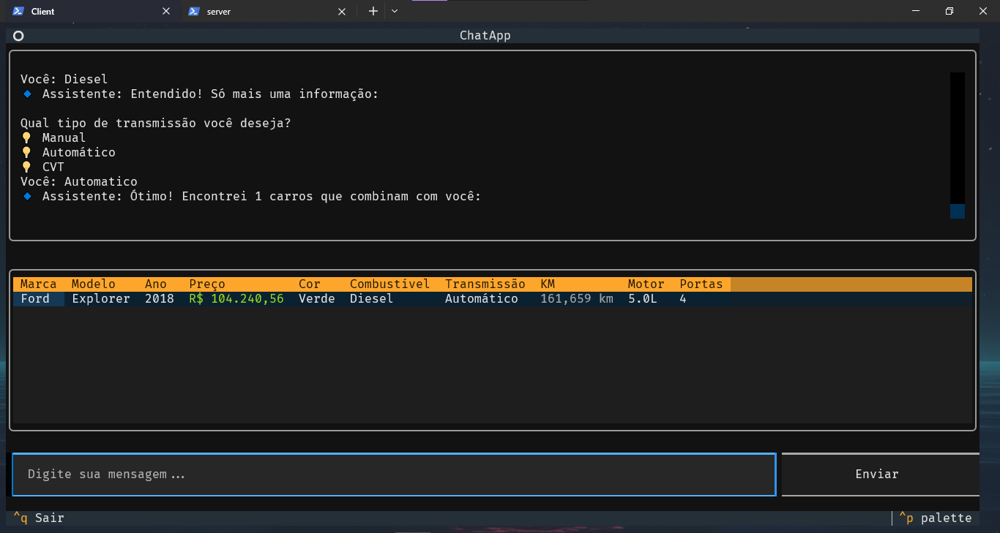

# **🚗 Sistema de Busca de Veículos - C2S Challenge**

Um sistema completo para busca de veículos com:
✔ **Servidor Python** (ZeroMQ para comunicação)
✔ **Cliente TUI** (Terminal UI com Textual)
✔ **Multi-banco de dados** (PostgreSQL ou SQLite)
✔ **Padrão de Projeto State + Repository**

---

## Motivação das decisões

- **ZeroMQ**: Conforme fui fazendo testes e implementando o código, a complexidade foi aumento, e para facilitar a comunicação `server > client` , optei por usar uma biblioteca de mensageria, deixando assim pra library, boa parte da lógica de enviar e receber mensagens.

- **Multi-Database**: A principio o sistema funcionaria apenas com Postgre, porém pensando em facilitar a usabilidade e deminuir os passos para configuração do mesmo, o código foi adaptado para utilizar também o SQLite, sendo uma alternativa mais rapida de configurar

- **Repository Pattern**: Durante o desenvolvimento pensei em conforme o usuario responde as perguntas já ir filtrando no banco os resultados. Por conta da experiência em precisar evitar fazer tanta queries no banco durante o processamento de dados, me senti motivado a pensar em uma alternativa mais otimizada para essa ideia, para isso usei o Design Pattern de Repositório, deixando assim os dados em cache/memória (dentro de um Dataframe pandas) e mantendo a lógica de filtragem apenas na classe que lida com os dados.

- **State Pattern**: Como o objetivo do sistema era receber diversos inputs do usuario para buscar uma lista de carros que atendesse seus critérios, deixei a parte de AA (Ask-Answer) utilizando o Design Pattern de Estado, facilitando o controle de fluxo das etapas de filtragem.

- **Textual**: No começo estava pensando em fazer apenas um "input" que receberia as respostas do cliente, mas para não ficar só um monte de texto na tela, escolhi usar o Textual que é uma biblioteca que já tem uma estilização padrão, e que não tem uma curva de aprendizado muito grande fazendo com que seja mais simples de trabalhar. E como um dos requisitos do desafio é ter mensagens amigáveis para mostrar pro client, uma interface bonita ajuda nesse aspecto também.

- **Docker/Podman**: Desde o inicio do projeto já tinha pensado em usar virtualização no servidor e no banco, como atualmente tem aparecido muitas demandas requerendo o uso de Kubernetes ou Docker, e também a eliminação dos conflitos de dependencias, seja por versão, seja por outras bibliotecas conflitantes.

---

## **🎯 Design Pattern e Arquitetura**

### **1. Padrão State (Máquina de Estados)**

- **Onde**: `conversation.py`
- **Objetivo**: Controlar o fluxo da conversa com o usuário em etapas (marca → modelo → preço → cor → etc.)
- **Como funciona**:
  - Cada etapa (`ConversationState`) define o comportamento do sistema
  - Transições de estado são acionadas pelas respostas do usuário

### **2. Repository Pattern**

- **Onde**: `repository.py`
- **Objetivo**: Isolar a lógica de acesso ao banco de dados
- **Vantagens**:
  - Troca de banco de dados sem afetar o resto do sistema
  - Consultas centralizadas e reutilizáveis

### **3. Injeção de Dependência**

- **Onde**: `ConversationManager` recebe `CarRepository`
- **Objetivo**: Facilitar testes e modularização

---

## **⚙️ Como Rodar**

### **📥 Pré-requisitos**

- Python 3.9+
- PostgreSQL (Se desejar usar)
- Docker/Podman (Se desejar  usar)

```bash
# Instalar dependências
pip install -r requirements.txt
```

---

## **🛢️ Opções de Banco de Dados**

### **1. SQLite (Padrão - Zero Config)**

- **Recomendado para desenvolvimento**
- **Como usar**:
  
  ```bash
  # O sistema já usa SQLite por padrão
  python main.py --server
  ```

### **2. PostgreSQL (Container - Recomendado para produção)**

```bash
# Subir PostgreSQL em container
# Com docker
docker run --name c2s-pg -e POSTGRES_USER=admin -e POSTGRES_PASSWORD=admin -e POSTGRES_DB=cars -p 5432:5432 -d postgres:13

# Com podman
podman run --name c2s-pg -e POSTGRES_USER=admin -e POSTGRES_PASSWORD=admin -e POSTGRES_DB=cars -p 5432:5432 -d docker.io/library/postgres:latest

# Rodar o servidor apontando para o PostgreSQL
DB_TYPE=postgresql python main.py --server
```

### **3. PostgreSQL (Local)**

1. Instale o PostgreSQL localmente
2. Crie um banco `cars`
3. Configure o `.env`:
   
   ```ini
   DB_TYPE=postgresql
   DB_HOST=localhost
   DB_PORT=5432
   DB_NAME=cars
   DB_USER=admin
   DB_PASSWORD=admin
   ```

---

## **🚀 Executando o Sistema**

### **1. Iniciar o Servidor**

```bash
python main.py --server
```

### **2. Iniciar o Cliente (Interface Terminal)**

```bash
python main.py --client
```

---

## **🐳 Docker Compose (Opcional)**

Crie um `docker-compose.yml` para subir tudo de uma vez:

```yaml
version: "3.8"

services:
  postgres:
    image: postgres:13
    environment:
      POSTGRES_USER: admin
      POSTGRES_PASSWORD: admin
      POSTGRES_DB: cars
    ports:
      - "5432:5432"
    volumes:
      - pg_data:/var/lib/postgresql/data

  server:
    build: .
    command: python -m server.server
    environment:
      DB_TYPE: postgresql
      DB_HOST: postgres
      DB_PORT: 5432
      DB_NAME: cars
      DB_USER: admin
      DB_PASSWORD: admin
    depends_on:
      - postgres

volumes:
  pg_data:
```

**Uso**:

```bash
docker-compose up
```

---

## **🔍 Estrutura do Projeto**

```
c2s_challenge/
├── client/             # Interface textual (TUI)
├── server/             # Lógica do servidor
│   ├── database.py     # Popula o banco
│   ├── models.py       # Modelo SQLAlchemy
│   ├── repository.py   # Repository Pattern
│   ├── conversation.py # State Pattern
│   └── server.py       # Servidor ZMQ
├── shared/             # Configurações globais
├── .env.example        # Modelo de configuração
├── requirements.txt    # Dependências
├── docker-compose.yaml # Uso de container
└── README.md
```

---

## **🔧 Comandos Úteis**

| Comando                                      | Descrição         |
| -------------------------------------------- | ----------------- |
| `DB_TYPE=postgresql python -m server.server` | Forçar PostgreSQL |
| `DB_TYPE=sqlite python -m server.server`     | Forçar SQLite     |

---

## **🎨 Screenshot do Cliente**



---

Feito com ❤️ por **Vicente Freire**
**GitHub**: [github.com/ryuvi](https://github.com/ryuvi)